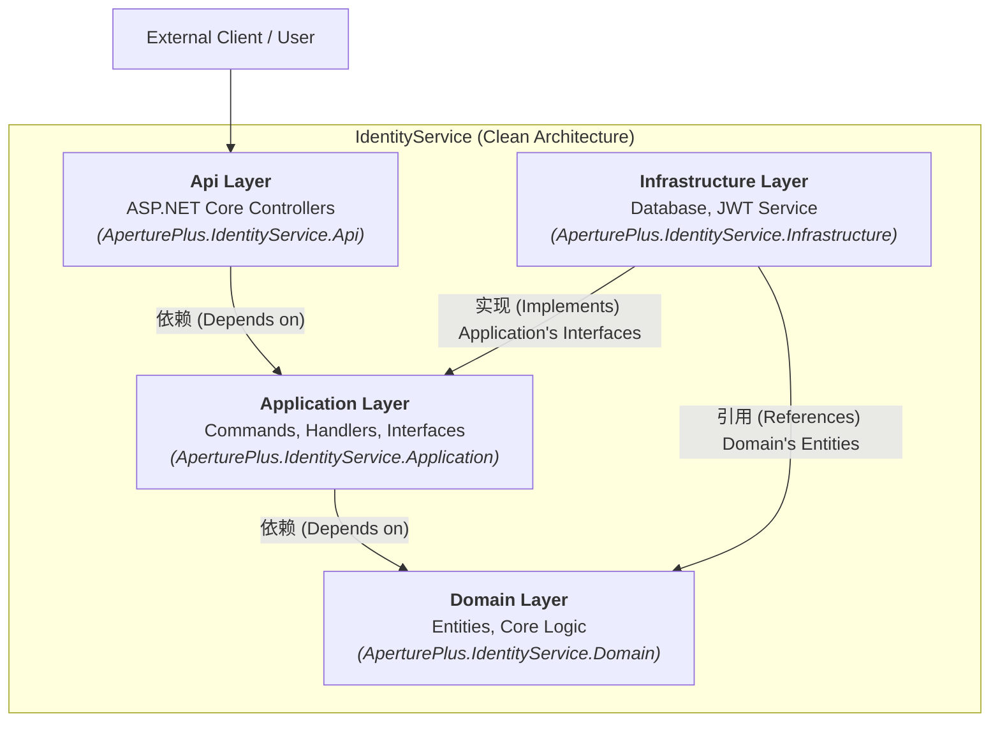

# AperturePlus

[](https://github.com)
[](https://www.gnu.org/licenses/agpl-3.0)

AperturePlus 是一个基于 .NET 构建的现代化后端解决方案，旨在提供一个健壮、可扩展且易于维护的应用程序基础。项目从一个功能完备的身份认证微服务 (`IdentityService`) 开始，并严格遵循**整洁架构 (Clean Architecture)** 和**领域驱动设计 (DDD)** 的原则。

## ✨ 核心架构

本项目采用整洁架构，将系统分为多个独立的层次，确保了关注点分离和低耦合。这种架构使得系统更容易测试、维护和扩展。



-   **Domain Layer**: 包含所有业务实体和核心业务规则，是整个应用程序的心脏，不依赖任何其他层。
-   **Application Layer**: 包含应用程序的用例（Use Cases），通过命令（Commands）和查询（Queries）来编排领域层的逻辑。
-   **Infrastructure Layer**: 提供与外部系统（如数据库、文件系统、第三方 API）交互的具体实现。
-   **Api Layer**: 暴露给客户端的接口，例如 RESTful API。

## 🛠️ 技术栈

-   **框架**: .NET 8 / ASP.NET Core 8
-   **数据访问**: Entity Framework Core 8
-   **架构模式**: Clean Architecture, DDD, CQRS
-   **身份认证**: JWT (JSON Web Tokens)
-   **容器化**: Docker / Docker Compose

## 🚀 如何开始

请遵循以下步骤来在本地运行此项目。

### 1. 先决条件

-   [.NET 8 SDK](https://dotnet.microsoft.com/download/dotnet/8.0)
-   [Docker Desktop](https://www.docker.com/products/docker-desktop) (推荐)
-   一个代码编辑器，如 [Visual Studio 2022](https://visualstudio.microsoft.com/) 或 [VS Code](https://code.visualstudio.com/)

### 2. 配置

1.  **克隆仓库**
    ```bash
    git clone https://github.com/your-username/AperturePlus.git
    cd AperturePlus
    ```

2.  **配置 `IdentityService`**
    打开 `src/services/IdentityService/AperturePlus.IdentityService.Api/appsettings.Development.json` 文件，并更新以下配置：

    ```json
    {
      "ConnectionStrings": {
        "DefaultConnection": "Server=localhost;Port=5432;Database=AperturePlus.Identity;User Id=youruser;Password=yourpassword;"
      },
      "JwtSettings": {
        "Secret": "THIS IS A SUPER SECRET KEY, CHANGE IT IN PRODUCTION",
        "Issuer": "AperturePlus",
        "Audience": "AperturePlus.Client"
      },
      "RoleSettings": {
        "Roles": [
          { "Name": "Admin" },
          { "Name": "User" }
        ]
      }
    }
    ```
    > **注意**: `DefaultConnection` 是你的数据库连接字符串。推荐使用 Docker 启动一个 PostgreSQL 实例。`JwtSettings.Secret` 应该被替换为一个更长、更安全的密钥。

3.  **应用数据库迁移**
    在终端中，导航到 `Infrastructure` 项目并运行 EF Core 的迁移命令来创建数据库和表结构。

    ```bash
    cd src/services/IdentityService/AperturePlus.IdentityService.Infrastructure
    dotnet ef database update --context IdentityServiceDbContext
    ```

### 3. 运行项目

你有两种方式可以启动此项目：

#### 方式 A: 使用 .NET CLI

```bash
# 导航到 Api 项目
cd src/services/IdentityService/AperturePlus.IdentityService.Api

# 运行项目
dotnet run
```

#### 方式 B: 使用 Docker Compose (推荐)

在项目根目录下运行以下命令，它将为你启动应用程序和数据库容器。

```bash
docker-compose up --build
```

项目现在应该在 `http://localhost:5000` (或你在 `launchSettings.json` 中配置的端口) 上运行。

## 📖 API 端点

以下是 `IdentityService` 提供的一些核心 API 端点。

### 注册新用户

-   **URL**: `/api/accounts/register`
-   **Method**: `POST`
-   **Body**:
    ```json
    {
      "email": "test@example.com",
      "password": "Password123!",
      "userName": "testuser"
    }
    ```

### 用户登录

-   **URL**: `/api/accounts/login`
-   **Method**: `POST`
-   **Body**:
    ```json
    {
      "email": "test@example.com",
      "password": "Password123!"
    }
    ```
-   **Success Response**:
    ```json
    {
      "token": "ey...",
      "userName": "testuser",
      "email": "test@example.com"
    }
    ```

## 📄 许可证

该项目使用 AGPL-3.0 许可证。有关详细信息，请参阅 `LICENSE` 文件。