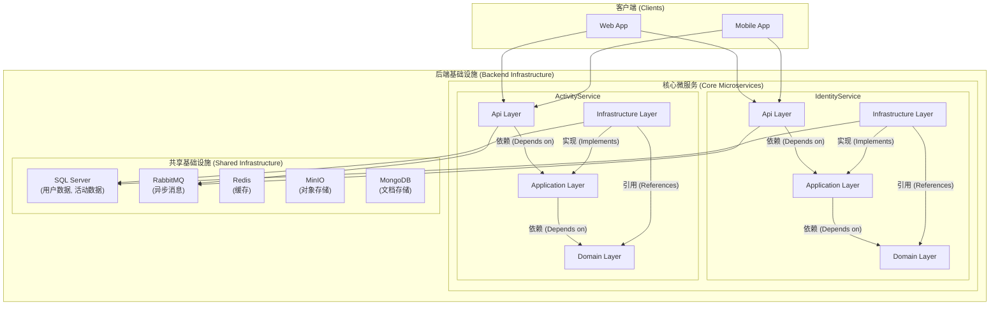

# AperturePlus

[](https://github.com)
[](https://www.gnu.org/licenses/agpl-3.0)

AperturePlus 是一个基于 .NET 构建的现代化微服务后端解决方案，旨在提供一个健壮、可扩展且易于维护的应用程序基础。项目严格遵循**整洁架构 (Clean Architecture)** 和**领域驱动设计 (DDD)** 的原则。

目前，系统包含以下核心微服务：
- **IdentityService**: 负责用户身份认证、授权和管理。
- **ActivityService**: 负责管理用户创建和参与的活动。

## ✨ 系统架构

本项目采用微服务架构，每个服务都遵循整洁架构（Clean Architecture），确保了关注点分离和低耦合。服务间的通信可以通过同步（HTTP）或异步（消息队列）方式进行。



## 🛠️ 技术栈

- **框架**: .NET 8 / ASP.NET Core 8
- **架构模式**: Microservices, Clean Architecture, DDD, CQRS
- **数据库**: SQL Server, Redis, MongoDB
- **数据访问**: Entity Framework Core 8
- **消息队列**: RabbitMQ
- **对象存储**: MinIO (S3-Compatible)
- **身份认证**: JWT (JSON Web Tokens)
- **容器化**: Docker / Docker Compose

## 🚀 如何开始

推荐使用 Docker 来启动和管理项目所需的所有服务。

### 1. 先决条件

-   [.NET 8 SDK](https://dotnet.microsoft.com/download/dotnet/8.0)
-   [Docker Desktop](https://www.docker.com/products/docker-desktop)

### 2. 配置 (使用 Docker)

1.  **克隆仓库**
    ```bash
    git clone https://github.com/your-username/AperturePlus.git
    cd AperturePlus
    ```

2.  **创建环境变量文件**
    在项目的根目录下，创建一个名为 `.env` 的文件。这个文件用来存放敏感信息，`docker-compose.yml` 会读取它。
    
    复制以下内容到 `.env` 文件中，并**务必修改密码**：
    ```env
    # .env
    
    # 为 SQL Server 设置一个强密码
    SQL_SERVER_PASSWORD=YourStrongPassword123!
    
    # 为 MinIO 对象存储设置凭证
    MINIO_ROOT_USER=minioadmin
    MINIO_ROOT_PASSWORD=minioadmin
    ```

3.  **更新连接字符串**
    `docker-compose.yml` 会启动一个名为 `aperture-sqlserver` 的 SQL Server 容器。请确保两个服务的 `appsettings.Development.json` 文件中的连接字符串指向这个容器。

    -   `src/services/IdentityService/AperturePlus.IdentityService.Api/appsettings.Development.json`
    -   `src/services/ActivityService/Api/appsettings.Development.json`

    将 `ConnectionStrings.DefaultConnection` 修改为：
    ```json
    "DefaultConnection": "Server=localhost,11433;Database=AperturePlus.Db;User Id=sa;Password=${SQL_SERVER_PASSWORD};TrustServerCertificate=True;"
    ```
    > **注意**: 我们使用 `localhost,11433` 是因为 `docker-compose.yml` 将容器的 `1433` 端口映射到了主机的 `11433` 端口。`${SQL_SERVER_PASSWORD}` 将由环境变量提供。

### 3. 运行项目

1.  **使用 Docker Compose 启动所有服务**
    在项目根目录下运行以下命令，它将构建并启动所有微服务和基础设施容器。
    ```bash
    docker-compose up --build -d
    ```
    `-d` 参数表示在后台运行。

2.  **应用数据库迁移**
    当容器启动后，我们需要应用数据库迁移来创建表结构。
    ```bash
    # 为 IdentityService 应用迁移
    dotnet ef database update --project src/services/IdentityService/AperturePlus.IdentityService.Infrastructure --startup-project src/services/IdentityService/AperturePlus.IdentityService.Api
    
    # 为 ActivityService 应用迁移
    dotnet ef database update --project src/services/ActivityService/Infrastructure --startup-project src/services/ActivityService/Api
    ```

现在，所有服务都已运行。
- **IdentityService** 运行在 `http://localhost:5001`
- **ActivityService** 运行在 `http://localhost:5002`
- **RabbitMQ Management** UI 在 `http://localhost:15672`
- **MinIO Console** 在 `http://localhost:9001`

## 📖 API 端点

### IdentityService

-   **注册新用户**: `POST /api/accounts/register`
-   **用户登录**: `POST /api/accounts/login`

### ActivityService

-   **创建活动**: `POST /api/activity/CreateActivity` (需要认证)
-   **获取所有活动**: `GET /api/activity/GetAllActivity`
-   **根据ID获取活动**: `GET /api/activity/GetActivityById/{id}`
-   **更新活动**: `PUT /api/activity/UpdateActivity/{id}` (需要认证)

## 📄 许可证

该项目使用 AGPL-3.0 许可证。有关详细信息，请参阅 `LICENSE` 文件。
