# AperturePlus

[](https://github.com)
[](https://www.gnu.org/licenses/agpl-3.0)

AperturePlus 是一个基于 .NET 构建的现代化微服务后端解决方案，旨在提供一个健壮、可扩展且易于维护的应用程序基础。项目严格遵循**整洁架构 (Clean Architecture)** 和**领域驱动设计 (DDD)** 的原则。

目前，系统包含以下核心微服务：
- **IdentityService**: 负责用户身份认证、授权和管理。
- **ActivityService**: 负责管理用户创建和参与的活动。
- **UserProfileService**: 负责管理用户的个人资料、简介和头像。
- **PortfolioService**: 负责管理用户的作品集、相册和照片。

## ✨ 系统架构

本项目采用微服务架构，每个服务都遵循整洁架构（Clean Architecture），确保了关注点分离和低耦合。服务间的通信可以通过同步（HTTP）或异步（消息队列）方式进行。

```mermaid
graph TD
    subgraph "客户端 (Clients)"
        direction LR
        WebApp["Web App"]
        MobileApp["Mobile App"]
    end

    subgraph "后端基础设施 (Backend Infrastructure)"
        direction TB
        
        subgraph "核心微服务 (Core Microservices)"
            direction LR
            
            subgraph "IdentityService"
                Api1["Api Layer"]
                App1["Application Layer"]
                Domain1["Domain Layer"]
                Infra1["Infrastructure Layer"]
            end

            subgraph "ActivityService"
                Api2["Api Layer"]
                App2["Application Layer"]
                Domain2["Domain Layer"]
                Infra2["Infrastructure Layer"]
            end

            subgraph "UserProfileService"
                Api3["Api Layer"]
                App3["Application Layer"]
                Domain3["Domain Layer"]
                Infra3["Infrastructure Layer"]
            end

            subgraph "PortfolioService"
                Api4["Api Layer"]
                App4["Application Layer"]
                Domain4["Domain Layer"]
                Infra4["Infrastructure Layer"]
            end
        end

        subgraph "共享基础设施 (Shared Infrastructure)"
            direction LR
            SQLServer["SQL Server<br>(用户数据, 活动数据)"]
            RabbitMQ["RabbitMQ<br>(异步消息)"]
            Redis["Redis<br>(缓存)"]
            MinIO["MinIO<br>(对象存储)"]
            Mongo["MongoDB<br>(文档存储)"]
        end

        %% Dependencies
        Api1 -- "依赖 (Depends on)" --> App1
        App1 -- "依赖 (Depends on)" --> Domain1
        Infra1 -- "实现 (Implements)" --> App1
        Infra1 -- "引用 (References)" --> Domain1

        Api2 -- "依赖 (Depends on)" --> App2
        App2 -- "依赖 (Depends on)" --> Domain2
        Infra2 -- "实现 (Implements)" --> App2
        Infra2 -- "引用 (References)" --> Domain2

        Api3 -- "依赖 (Depends on)" --> App3
        App3 -- "依赖 (Depends on)" --> Domain3
        Infra3 -- "实现 (Implements)" --> App3
        Infra3 -- "引用 (References)" --> Domain3

        Api4 -- "依赖 (Depends on)" --> App4
        App4 -- "依赖 (Depends on)" --> Domain4
        Infra4 -- "实现 (Implements)" --> App4
        Infra4 -- "引用 (References)" --> Domain4
        
        Infra1 --> SQLServer
        Infra2 --> SQLServer
        Infra3 --> SQLServer
        Infra4 --> SQLServer
        
        Api1 --> RabbitMQ
        Api2 --> RabbitMQ
        Infra4 --> MinIO
    end

    WebApp --> Api1
    WebApp --> Api2
    WebApp --> Api3
    WebApp --> Api4
    MobileApp --> Api1
    MobileApp --> Api2
    MobileApp --> Api3
    MobileApp --> Api4
```



## 🛠️ 技术栈

- **框架**: .NET 8 / ASP.NET Core 8
- **架构模式**: Microservices, Clean Architecture, DDD, CQRS
- **数据库**: SQL Server, Redis, MongoDB
- **数据访问**: Entity Framework Core 8
- **消息队列**: RabbitMQ
- **对象存储**: MinIO (S3-Compatible)
- **身份认证**: JWT (JSON Web Tokens)
- **容器化**: Docker / Docker Compose

## 🚀 如何开始

### 1. 先决条件

-   [.NET 8 SDK](https://dotnet.microsoft.com/download/dotnet/8.0)
-   [Docker Desktop](https://www.docker.com/products/docker-desktop)

### 2. 配置

1.  **克隆仓库**
    ```bash
    git clone https://github.com/your-username/AperturePlus.git
    cd AperturePlus
    ```

2.  **创建环境变量文件**
    在项目的根目录下，创建一个名为 `.env` 的文件。这个文件用来存放敏感信息，`docker-compose.yml` 会读取它。
    
    复制以下内容到 `.env` 文件中，并**务必修改密码**：
    ```env
    # .env
    
    # 为 SQL Server 设置一个强密码
    SQL_SERVER_PASSWORD=YourStrongPassword123!
    
    # 为 MinIO 对象存储设置凭证
    MINIO_ROOT_USER=minioadmin
    MINIO_ROOT_PASSWORD=minioadmin
    ```

3.  **更新连接字符串**
    `docker-compose.yml` 会启动一个名为 `aperture-sqlserver` 的 SQL Server 容器。请确保所有服务的 `appsettings.Development.json` 文件中的连接字符串都指向这个容器。

    -   `src/services/IdentityService/AperturePlus.IdentityService.Api/appsettings.Development.json`
    -   `src/services/ActivityService/Api/appsettings.Development.json`
    -   `src/services/UserProfileService/AperturePlus.UserProfileService.Api/appsettings.Development.json`
    -   `src/services/PortfolioService/AperturePlus.PortfolioService.Api/appsettings.Development.json`

    将 `ConnectionStrings.DefaultConnection` 修改为：
    ```json
    "DefaultConnection": "Server=localhost,11433;Database=AperturePlus.Db;User Id=sa;Password=${SQL_SERVER_PASSWORD};TrustServerCertificate=True;"
    ```
    > **注意**: 我们使用 `localhost,11433` 是因为 `docker-compose.yml` 将容器的 `1433` 端口映射到了主机的 `11433` 端口。`${SQL_SERVER_PASSWORD}` 将由环境变量提供。

### 3. 运行项目

1.  **使用 Docker Compose 启动基础设施**
    在项目根目录下运行以下命令，它将启动所有数据库和消息队列等基础设施容器。
    ```bash
    docker-compose up --build -d
    ```
    `-d` 参数表示在后台运行。

2.  **启动 .NET 微服务**
    在 Visual Studio 中打开 `AperturePlus.sln` 并设置为启动多个项目，或者在终端中为每个服务单独执行 `dotnet run`。
    ```bash
    # 启动 IdentityService
    dotnet run --project src/services/IdentityService/AperturePlus.IdentityService.Api

    # 启动 ActivityService
    dotnet run --project src/services/ActivityService/Api

    # 启动 UserProfileService
    dotnet run --project src/services/UserProfileService/AperturePlus.UserProfileService.Api

    # 启动 PortfolioService
    dotnet run --project src/services/PortfolioService/AperturePlus.PortfolioService.Api
    ```

3.  **应用数据库迁移**
    当服务首次运行时，需要应用数据库迁移来创建表结构。
    ```bash
    # 为 IdentityService 应用迁移
    dotnet ef database update --project src/services/IdentityService/AperturePlus.IdentityService.Infrastructure --startup-project src/services/IdentityService/AperturePlus.IdentityService.Api
    
    # 为 ActivityService 应用迁移
    dotnet ef database update --project src/services/ActivityService/Infrastructure --startup-project src/services/ActivityService/Api

    # 为 UserProfileService 应用迁移
    dotnet ef database update --project src/services/UserProfileService/AperturePlus.UserProfileService.Infrastructure --startup-project src/services/UserProfileService/AperturePlus.UserProfileService.Api

    # 为 PortfolioService 应用迁移
    dotnet ef database update --project src/services/PortfolioService/AperturePlus.PortfolioService.Infrastructure --startup-project src/services/PortfolioService/AperturePlus.PortfolioService.Api
    ```

### 4. 服务运行地址

- **IdentityService**: `http://localhost:5001`
- **ActivityService**: `http://localhost:5002`
- **UserProfileService**: `http://localhost:5034`
- **PortfolioService**: `http://localhost:5106`
- **RabbitMQ Management** UI: `http://localhost:15672`
- **MinIO Console**: `http://localhost:9001`

## 📖 API 端点

### IdentityService

-   `POST /api/accounts/register`: 注册新用户
-   `POST /api/accounts/login`: 用户登录
-   `PUT /api/accounts/UpdateRoles`: 更新用户角色 (需要认证)
-   `GET /api/admin/test`: 测试管理员权限 (需要Admin角色认证)

### ActivityService

-   `POST /api/activity/CreateActivity`: 创建活动 (需要认证)
-   `GET /api/activity/GetAllActivity`: 获取所有活动（分页）
-   `GET /api/activity/GetActivityById/{id}`: 根据ID获取活动
-   `GET /api/activity/GetActivitiesByUserId/{id}`: 根据用户ID获取活动
-   `PATCH /api/activity/UpdateActivity/{id}`: 更新活动 (需要认证)
-   `POST /api/activity/CancelActivity/{activityId}`: 取消活动 (需要认证)
-   `POST /api/activity/CompletedActivity/{activityId}`: 完成活动 (需要认证)
-   `POST /api/activity/RequestJoinActivity/{activityId}`: 申请加入活动 (需要认证)
-   `POST /api/activity/ApproveParticipant/{activityId}/{applicantId}`: 批准参与者 (需要认证)
-   `POST /api/activity/RejectParticipant/{activityId}/{applicantId}`: 拒绝参与者 (需要认证)

### UserProfileService

-   `GET /api/userprofile/GetUserProfileById/{id}`: 根据 ID 获取用户资料
-   `GET /api/userprofile/GetMyProfile`: 获取当前登录用户的资料 (需要认证)
-   `PATCH /api/userprofile/UpdateMyProfile`: 更新当前用户的资料 (需要认证)

### PortfolioService

-   `POST /api/portfolios/CreateGallery/{galleryName}`: 创建相册 (需要认证)
-   `POST /api/portfolios/UploadPhotos/{galleryId}`: 上传照片到相册 (需要认证)
-   `GET /api/portfolios/GetPortfolioByUserId`: 获取用户的作品集 (需要认证)
-   `DELETE /api/portfolios/DeleteGallery/{galleryId}`: 删除相册 (需要认证)
-   `DELETE /api/portfolios/DeletePhoto/{galleryId}`: 删除照片 (需要认证)

## 📄 许可证

该项目使用 AGPL-3.0 许可证。有关详细信息，请参阅 `LICENSE` 文件。
